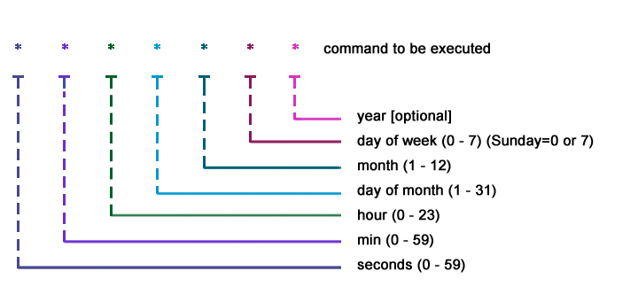

## 什么是 Cron

Cron 是一款类 Unix 的操作系统下基于时间的任务管理系统。用户可以在 Unix 系统使用 Cron 语法定义任务在固定时间、日期、间隔下运行

## Cron 语法

### 语法说明

| 字段 | 必选 | 值                  | 特殊字符       | 备注               |
| ---- | ---- | ------------------- | -------------- | ------------------ |
| 秒   | Yes  | 0 - 59              | \* , - /       |                    |
| 小时 | Yes  | 0 - 23              | \* , - /       |                    |
| 天   | Yes  | 1 - 31              | \* , - / ? L W |                    |
| 月   | Yes  | 1 - 12 or JAN - DEC | \* , - /       |                    |
| 周   | Yes  | 0 - 6 or SUN - SAT  | \* , - / ? L # |                    |
| 年   | No   | 1970-2099           | \* , - /       | 标准中没有这个字段 |

### 符号说明

| 符号 | 作用                                                                |
| ---- | ------------------------------------------------------------------- |
| \*   | 合法值中的任意值                                                    |
| -    | 表示指定范围                                                        |
| ,    | 列表值                                                              |
| /    | 用于指定增量 start / step 从 start 开始，每 step 触发               |
| ?    | 主要用于在 Day-of-Month 和 Day-of-Week 中，指没有具体的值，避免冲突 |
| L    | Day-of-Month 和 Day-of-Week 中 最后一天，XL 倒数 X 天               |
| W    | Day-of-Month 中，用来描述最近的工作日，LW 最后一个周五              |
| #    | Day-of-week 中，指定这个月的第几个周几，6#3 指第三个周五            |
